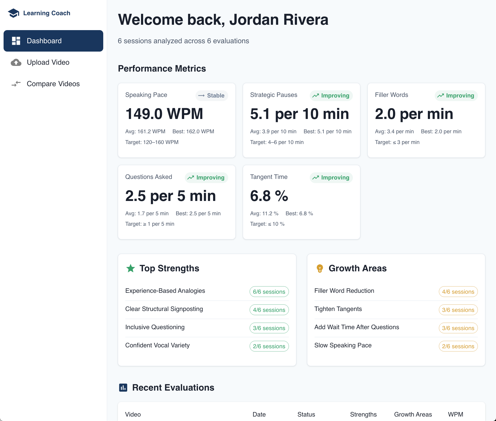
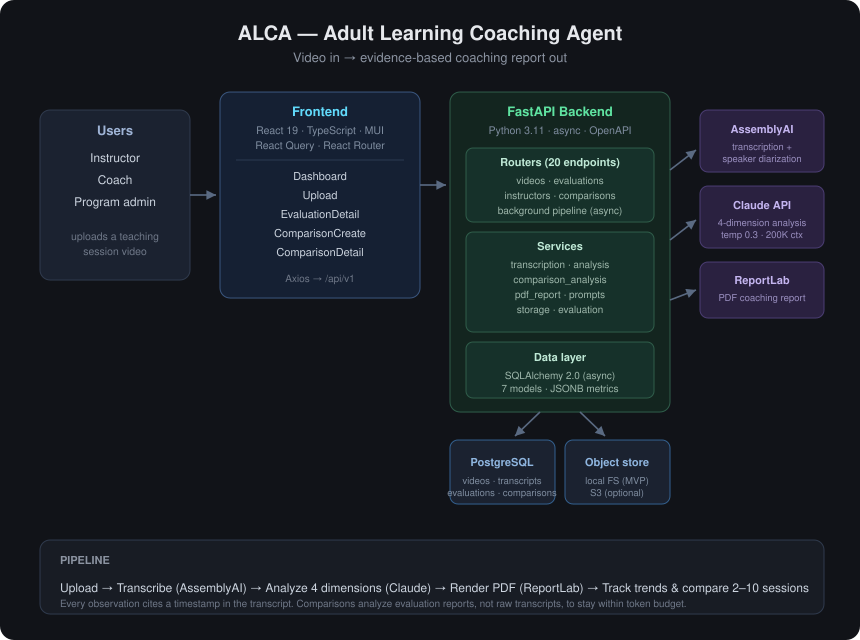
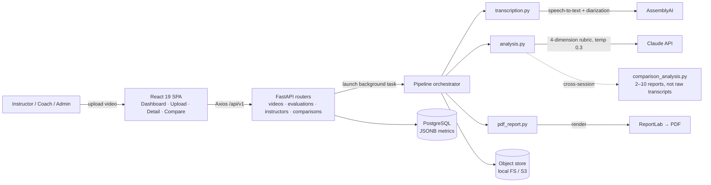
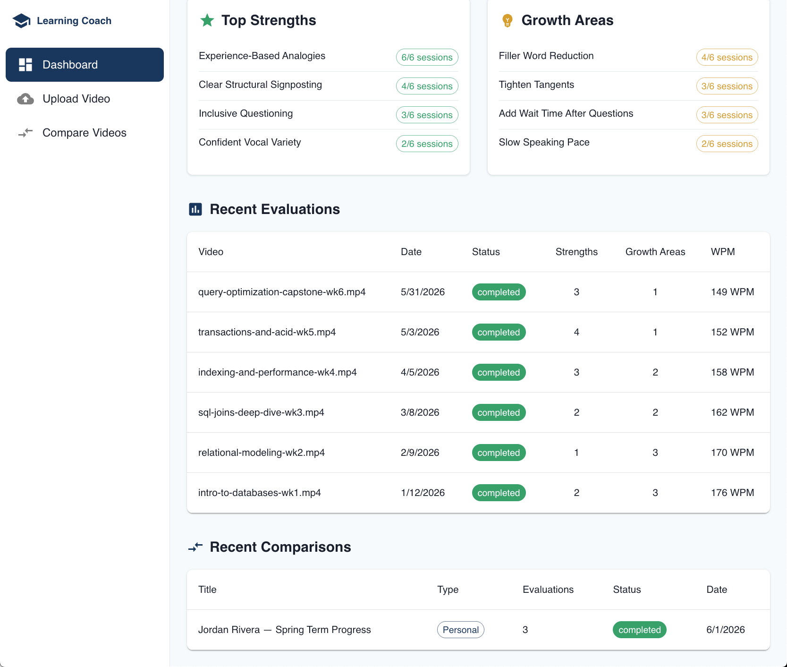
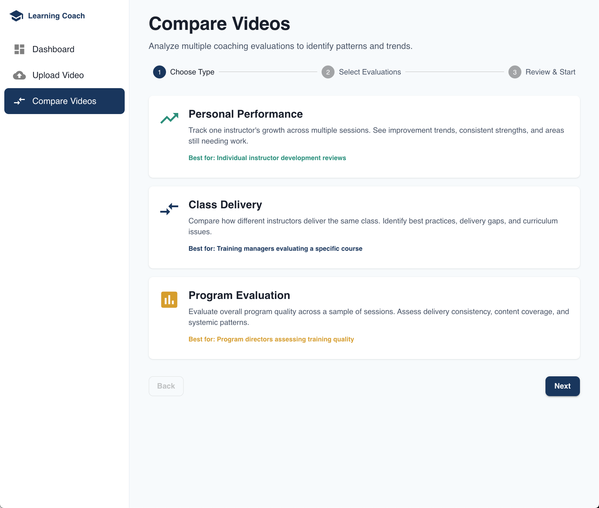

# ALCA — Adult Learning Coaching Agent

**AI coaching for instructor quality: video in, evidence-based report out — in minutes, not hours**

[Problem](#the-problem) • [Architecture](#architecture) • [Results](#results) • [Quick Start](#quick-start) • [API](#api-documentation) • [Demo Scenarios](#demo-scenarios) • [About](#about-the-author)

[](https://github.com/drdgreed/adult-learning-coach-showcase/actions/workflows/ci.yml)
[](https://www.python.org/)
[](https://fastapi.tiangolo.com/)
[](https://react.dev/)
[](https://anthropic.com/)
[](https://www.assemblyai.com/)
[](#results)
[](#portfolio-disclaimer)
[](LICENSE)

<p align="center">
  
</p>

<p align="center"><sub><em>The instructor dashboard — six analyzed sessions with metric trends, recurring strengths, and growth areas. Synthetic demo data.</em></sub></p>

---

## Portfolio disclaimer

ALCA is published as an **engineering portfolio and evaluation artifact**, not a production service. It runs against **synthetic instructor data only** — no real learner or employee recordings are stored in or distributed with this repository. The cost figures, latencies, and pass rates below are labeled at the point of use as **measured**, **documented**, or **estimated** so a reader always knows which is which. See [SECURITY.md](SECURITY.md) for the data-handling posture and any production-deployment obligations.

---

## Overview

Organizations that train at scale — corporate L&D teams, EdTech companies, professional-development providers — face the same bottleneck: **evaluating instructor quality is slow, subjective, and unrepeatable.** A thorough manual evaluation of a single recorded session takes a skilled coach **10–14 hours** (watch, take notes, write the report), feedback lands weeks late, and two evaluators rarely score the same session the same way.

ALCA turns a recorded teaching session into a **structured, evidence-cited coaching report**: it transcribes the video, analyzes teaching effectiveness across **four research-backed dimensions**, and renders a professional PDF — bringing the loop from 10–14 hours down to a **90–120-minute** upload-and-review. Every observation is anchored to a **timestamped citation** in the transcript, and every metric shows its calculation, so the feedback is auditable rather than impressionistic. A second analysis layer compares **2–10 sessions** to surface longitudinal trends across an instructor, a class, or a whole program.

### The Problem

- A single thorough evaluation costs a coach **10–14 hours** of watch-note-write time *(documented baseline — the manual workflow ALCA replaces)*.
- **Inter-rater inconsistency**: feedback quality and emphasis vary by evaluator, so scores aren't comparable across instructors or over time.
- **Latency**: instructors receive feedback weeks after the session, when the teaching moment is cold.
- **No longitudinal view**: without a consistent rubric and historical store, "is this instructor improving?" is unanswerable.

### The Solution

ALCA is an async FastAPI pipeline fronted by a React dashboard. A video upload kicks off a background job that (1) transcribes with **AssemblyAI** (speaker diarization + word-level timestamps), (2) analyzes the transcript with **Claude** against a four-dimension rubric at low temperature for reproducibility, and (3) renders a branded PDF with **ReportLab**. Results persist to **PostgreSQL** (relational integrity for users and videos, JSONB for the open-ended metric payloads), so historical trends and cross-session comparisons fall out of the same data model. The four dimensions — **Clarity & Pacing**, **Engagement Techniques**, **Explanation Quality**, and **Time Management** — are each scored with shown calculations (e.g. words-per-minute against a 120–160 target, tangent time against a <10% threshold) and backed by transcript citations.

---

## Architecture

<p align="center">
  
</p>

<details>
<summary>Mermaid source (click to expand)</summary>



</details>

---

## Results

Numbers are labeled by provenance: **measured** (observed in this repo), **documented** (the baseline workflow ALCA replaces), or **estimated** (modeled from current vendor pricing). No production-traffic claims are made.

| Metric | Value | Provenance |
|---|---|---|
| **Backend test suite** | 61 async integration tests against a real PostgreSQL instance | *measured* — `pytest backend/tests` |
| **Analysis dimensions** | 4 (Clarity & Pacing, Engagement, Explanation Quality, Time Management) | *implemented* — `services/prompts_content.py` |
| **Evidence standard** | Every observation cites a transcript timestamp; every metric shows its calculation | *implemented* — analysis schema |
| **Speaking-pace target** | 120–160 WPM, scored per session | *implemented* — rubric |
| **Tangent threshold** | <10% of class time flags a time-management finding | *implemented* — `tangent_percentage` metric |
| **Cross-session comparison** | 2–10 evaluations, range-enforced in the schema validator | *measured* — `schemas/comparisons.py` |
| **Evaluation turnaround** | 10–14 h manual → **90–120 min** upload-and-review | *documented* baseline vs. target |
| **Cost per evaluation** | **~$1.30** (1-h video) to **~$5.85** (6-h video) | *estimated* — AssemblyAI + Claude at 2026 pricing |
| **Cost per comparison** | **~$0.15** (3 sessions) to **~$0.40** (10 sessions) | *estimated* — reports-not-transcripts keeps tokens low |
| **PDF rendering** | On-demand, no stored artifacts | *implemented* — ReportLab, `pdf_report.py` |

---

## Tech Stack

| Layer | Technology | Notes |
|-------|------------|-------|
| **LLM** | Claude (Anthropic API), Sonnet 4.5 | Low temperature (0.3) for reproducible scoring; 200K context handles 6-hour transcripts |
| **Transcription** | AssemblyAI | Speaker diarization + word-level timestamps; citations anchor to these |
| **Backend** | Python 3.11, FastAPI, Pydantic v2 | Async throughout; automatic OpenAPI docs at `/docs` |
| **Database** | PostgreSQL 15+, SQLAlchemy 2.0 (async), asyncpg | Relational core + JSONB for open-ended metric payloads |
| **PDF** | ReportLab | On-demand coaching + comparison reports, no storage needed |
| **Storage** | Local filesystem (MVP), AWS S3 via boto3 (optional) | One abstraction, swap by config |
| **Frontend** | React 19, TypeScript, MUI, React Query, React Router | Axios client, five route-level pages |
| **Background work** | FastAPI `BackgroundTasks` (MVP) | Celery + Redis path scoped for Phase 2 |
| **Testing** | pytest, pytest-asyncio, httpx | 61 integration tests against real PostgreSQL fixtures |
| **CI** | GitHub Actions | Backend lint + tests, frontend type-check + build |

---

## Quick Start

### Prerequisites
- Python 3.11+ · Node.js 18+ · PostgreSQL 15+
- An [AssemblyAI API key](https://www.assemblyai.com/) and an [Anthropic API key](https://console.anthropic.com/)

```bash
git clone https://github.com/drdgreed/adult-learning-coach-showcase.git
cd adult-learning-coach-showcase

# Backend
cd backend
python -m venv venv && source venv/bin/activate     # Windows: venv\Scripts\activate
pip install -r requirements.txt
cp .env.example .env                                 # add DB URL, API keys, SECRET_KEY
uvicorn app.main:app --reload --port 8000

# Frontend (separate terminal)
cd frontend && npm install && npm start
```

The app opens at **http://localhost:3000**; the API and interactive Swagger docs are at **http://localhost:8000** and **http://localhost:8000/docs**.

```bash
# Run the backend test suite
cd backend && python -m pytest
```

---

## Demo Scenarios

**Scenario 1 — Single-session coaching report.**
Input: a 45-minute recorded training session (MP4). Expected: ALCA transcribes it, scores all four dimensions, and renders a 12–20-page PDF. Outcome: the instructor sees, e.g., "speaking pace 178 WPM — above the 120–160 target; three runs exceed 200 WPM at [12:04], [27:31], [38:50]," each linked to the transcript moment.

**Scenario 2 — Personal performance trend.**
Input: 5 completed evaluations for the same instructor across a quarter, compared as `personal_performance`. Expected: Claude analyzes the five *reports* (not raw transcripts) and reports directional trends with a 5% threshold. Outcome: "filler-word rate trending down (−18% first-to-last); question frequency stable" — a longitudinal view no single report can give.

**Scenario 3 — Program evaluation.**
Input: a 10-session sample across a training program, compared as `program_evaluation`. Expected: aggregated averages, min/max ranges, and quality distribution across instructors. Outcome: a program director sees consistency gaps and shared strengths in one PDF — the cross-instructor view that justifies curriculum or coaching investment.

---

## Screenshots

<p align="center">
  
</p>
<p align="center"><sub><em>Dashboard, continued — recurring strengths and growth areas, the full evaluation history (six completed sessions with per-session metrics), and recent cross-session comparisons.</em></sub></p>

<p align="center">
  
</p>
<p align="center"><sub><em>The comparison builder — pick one of three analytical lenses, select 2–10 sessions, and run a cross-session analysis. Synthetic demo data throughout.</em></sub></p>

---

## API Documentation

Twenty endpoints across videos, evaluations, instructor dashboards, and comparisons. The full set is auto-documented at `/docs`; the comparison flow is representative:

```bash
# Create and start a cross-session comparison
curl -X POST http://localhost:8000/api/v1/comparisons \
  -H "Content-Type: application/json" \
  -d '{
    "title": "Q1 Teaching Performance",
    "comparison_type": "personal_performance",
    "evaluation_ids": ["eval-uuid-1", "eval-uuid-2", "eval-uuid-3"],
    "created_by_id": "instructor-uuid",
    "start_immediately": true
  }'

# Poll for completion: status "queued" → "analyzing" → "completed"
curl http://localhost:8000/api/v1/comparisons/{id}

# Fetch JSON report, then download the branded PDF
curl http://localhost:8000/api/v1/comparisons/{id}/report
curl -o comparison.pdf http://localhost:8000/api/v1/comparisons/{id}/report/pdf
```

| Method | Endpoint | Description |
|--------|----------|-------------|
| `POST` | `/api/v1/videos/upload` | Upload a training video (MP4/MOV/WebM/AVI, ≤10 GB) |
| `GET` · `DELETE` | `/api/v1/videos/{id}` | Get / delete a video |
| `POST` | `/api/v1/evaluations` | Start a coaching evaluation (async) |
| `GET` | `/api/v1/evaluations/{id}` | Status: `queued → transcribing → analyzing → completed` |
| `GET` | `/api/v1/evaluations/{id}/report` · `/report/pdf` | Coaching report as JSON or PDF |
| `GET` | `/api/v1/instructors/{id}/dashboard` | Performance dashboard + metric trends |
| `POST` · `GET` | `/api/v1/comparisons` | Create / list cross-session comparisons |
| `GET` | `/api/v1/comparisons/{id}/report/pdf` | Comparison PDF |
| `GET` | `/health` | Health check with database status |

---

## Project Structure

```
alca-showcase/
├── backend/
│   ├── app/
│   │   ├── main.py            # FastAPI entry point
│   │   ├── config.py          # Pydantic settings from .env
│   │   ├── database.py        # async SQLAlchemy engine/session
│   │   ├── models/            # 7 models: User, Video, Transcript, Evaluation,
│   │   │                      #   Comparison, ComparisonEvaluation, Organization
│   │   ├── routers/           # videos · evaluations · instructors · comparisons
│   │   ├── schemas/           # Pydantic request/response (2–10 comparison validator)
│   │   └── services/          # transcription · analysis · comparison_analysis ·
│   │       │                  #   pdf_report · comparison_pdf · prompts · storage
│   │       └── ...            #   evaluation + comparison pipeline orchestrators
│   └── tests/                 # 61 async integration tests (real PostgreSQL)
├── frontend/
│   └── src/
│       ├── api/client.ts      # Axios wrapper for all endpoints
│       ├── pages/             # Dashboard · Upload · EvaluationDetail ·
│       │                      #   ComparisonCreate · ComparisonDetail
│       ├── components/        # Layout, navigation
│       └── theme/             # MUI theme
└── docs/assets/architecture.svg
```

---

## Roadmap & Limitations

Honest status — this is an MVP (Phase 1) of the core pipeline plus cross-session comparison.

**Built and working**
- Video upload with format/size validation, AssemblyAI transcription, four-dimension Claude analysis, ReportLab PDF, historical trend tracking, the React dashboard, and 2–10-session comparisons.
- 61 backend integration tests against a real PostgreSQL instance.

**Known limitations (by design, for an MVP)**
- **No live hosted demo yet** — the Quick Start runs it locally. A hosted demo is the top roadmap item (see below).
- **Background work uses FastAPI `BackgroundTasks`**, not a Celery/Redis queue; fine for demo scale, not yet for production throughput.
- **No LLM evaluation harness yet** (DeepEval/Promptfoo/Ragas) — analysis quality is currently asserted by integration tests, not a judge suite. Adding one is on the roadmap.
- **Auth is scaffolded, not enforced** — role-based access control is Phase 2. Do not deploy publicly as-is.
- The standalone "reflection worksheet" PDF was **merged into the main report** in the v2 prompt refresh; there is no separate worksheet endpoint.

**Roadmap (Phase 2):** hosted demo (Railway backend + Vercel frontend) · auth + RBAC · S3 storage · Celery/Redis queue · LLM eval suite · coach/admin views · per-org custom rubrics.

---

## About the Author

**David Reed, Ph.D.** — Head of AI/ML & Agentic Delivery at Interview Kickstart. PhD in Computer Science, MBA, PMP, Wharton AI Fellow. Sole inventor of [US Patent 6,850,988](https://patents.google.com/patent/US6850988) — the foundational recommendation-engine architecture later widely deployed in commerce. Formerly Master Technologist at Hewlett-Packard (Distinguished/Principal-IC track) and Principal TPM-AI at Microsoft. 35+ years across data warehousing, enterprise AI/ML, and edtech, including leading a $70M data-science curriculum portfolio across R1 universities.

I built ALCA to demonstrate end-to-end agentic AI engineering on a problem I know firsthand from running instruction at scale: **evaluating teaching quality is expensive, subjective, and slow.** The interesting engineering is in making LLM judgment *auditable* — every score traces to a timestamped transcript citation and a shown calculation, so a coach can trust, contest, or override it. The same data model that produces one report produces longitudinal trends and cross-session comparisons, which is where the real coaching value compounds.

[Portfolio](https://drdavidreed.com) · [LinkedIn](https://linkedin.com/in/drdgreed) · drdgreed@gmail.com

---

## Contributing

Setup, branching, and the PR workflow are in [CONTRIBUTING.md](CONTRIBUTING.md). Issues use the templates under [`.github/ISSUE_TEMPLATE/`](.github/ISSUE_TEMPLATE/); for security reports follow [SECURITY.md](SECURITY.md) rather than opening a public issue. By contributing you agree to the [Code of Conduct](CODE_OF_CONDUCT.md).

## License

[MIT](LICENSE).

## Acknowledgments

- **Claude** (Anthropic) for the analysis layer and **AssemblyAI** for transcription.
- The instructional-coaching research on clarity, engagement, explanation, and time management that grounds the four-dimension rubric.
- Built as part of an AI/ML engineering portfolio. Synthetic data only — see the [Portfolio disclaimer](#portfolio-disclaimer).

---

**ALCA** — Instructor Coaching, Evidence-Cited and Repeatable
*github.com/drdgreed/adult-learning-coach-showcase · David Reed, PhD · 2026*
